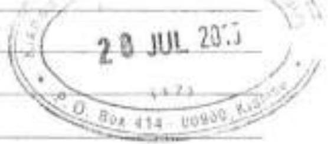

# KNEC Past Papers: PDF to HTML Conversion Guide

You are tasked with converting PDF past papers into well-structured HTML files with proper styling, mathematical equations, and images. This comprehensive prompt contains all instructions and templates you need.

## 1. Project Structure

Create this folder structure:
```
pastpapers/
├── js/                        # JavaScript files
├── components/                # Reusable HTML components  
├── images/                    # Downloaded images
├── styles.css                 # CSS styles
├── index.html                 # Main landing page
├── [paper-name].html          # Individual paper pages (e.g., 2023j.html)
└── [paper-name]_ocr.mmd       # OCR output files
```

## 2. OCR Process

Convert PDFs to Markdown Math (MMD) format using Mathpix OCR:
```bash
# Create tracking file
touch processed.txt

# Run OCR on each PDF
node /home/ngobiro/projects/mathpix-ocr-server/build/index.js "/full/path/to/2022n.pdf" > "2022n_ocr.mmd"

# Track processed files
echo "2022n.pdf" >> processed.txt
```

## 3. HTML Templates

### 3.1 Base HTML Structure (for each paper)

```html
<!DOCTYPE html>
<html lang="en">
<head>
    <meta charset="UTF-8">
    <meta name="viewport" content="width=device-width, initial-scale=1.0">
    <title>[SUBJECT] - [MONTH] [YEAR] | KNEC Past Papers</title>
    <link rel="stylesheet" href="styles.css">
    <script src="js/sidebar-navigation.js" defer></script>
    <script src="https://polyfill.io/v3/polyfill.min.js?features=es6"></script>
    <script id="MathJax-script" async src="https://cdn.jsdelivr.net/npm/mathjax@3/es5/tex-mml-chtml.js"></script>
</head>
<body>
    <header>
        <div class="container">
            <h1>[SUBJECT]</h1>
            <h2>[MONTH] [YEAR]</h2>
            <div class="exam-details">
                <p>Paper Code: [PAPER CODE]</p>
                <p>Duration: [DURATION]</p>
                <p>Module: [MODULE]</p>
            </div>
        </div>
    </header>
    <div class="container main-content">
        <!-- Sidebar -->
        <div class="sidebar">
            <div class="sidebar-header">
                <h3>Past Papers</h3>
            </div>
            <nav class="sidebar-nav">
                <ul>
                    <li><a href="2023j.html">July 2023</a></li>
                    <li><a href="2022n.html">November 2022</a></li>
                    <li><a href="2022j.html">July 2022</a></li>
                    <li><a href="index.html">Home</a></li>
                </ul>
            </nav>
        </div>
        
        <main>
            <div class="paper-navigation top">
                <a href="previous-paper.html" class="btn">Previous Paper</a>
                <a href="index.html" class="btn">Home</a>
                <a href="next-paper.html" class="btn">Next Paper</a>
            </div>

            <section class="paper-intro">
                <h3>Instructions to Candidates</h3>
                <ul>
                    <li>This paper consists of SIX questions.</li>
                    <li>Answer any FOUR questions.</li>
                    <li>All questions carry equal marks.</li>
                    <li>Write your answers in the answer booklet provided.</li>
                </ul>
            </section>

            <section class="paper-content">
                <!-- Questions will be added here -->
            </section>

            <div class="paper-navigation bottom">
                <a href="previous-paper.html" class="btn">Previous Paper</a>
                <a href="index.html" class="btn">Home</a>
                <a href="next-paper.html" class="btn">Next Paper</a>
            </div>
        </main>
    </div>
    <footer>
        <div class="container">
            <p>&copy; 2025 [SUBJECT] Past Papers Collection | Kenya National Examinations Council</p>
        </div>
    </footer>
</body>
</html>
```

### 3.2 Index Page Template

```html
<!DOCTYPE html>
<html lang="en">
<head>
    <meta charset="UTF-8">
    <meta name="viewport" content="width=device-width, initial-scale=1.0">
    <title>[SUBJECT] Past Papers Collection</title>
    <link rel="stylesheet" href="styles.css">
    <script src="js/sidebar-navigation.js" defer></script>
</head>
<body>
    <header>
        <div class="container">
            <h1>[SUBJECT]</h1>
            <h2>Past Papers Collection</h2>
            <div class="exam-details">
                <p>Paper Code: [PAPER CODE]</p>
                <p>Module: [MODULE]</p>
            </div>
        </div>
    </header>
    
    <div class="container main-content">
        <!-- Sidebar -->
        <div class="sidebar">
            <div class="sidebar-header">
                <h3>Past Papers</h3>
            </div>
            <nav class="sidebar-nav">
                <ul>
                    <li><a href="2023j.html">July 2023</a></li>
                    <li><a href="2022n.html">November 2022</a></li>
                    <li><a href="2022j.html">July 2022</a></li>
                    <li><a href="index.html" class="active">Home</a></li>
                </ul>
            </nav>
        </div>
        
        <main>
            <section class="intro">
                <h2>Past Papers with Detailed Solutions</h2>
                <p>A comprehensive collection of KNEC [SUBJECT] past papers with detailed answers and explanations.</p>
            </section>

            <section class="year-section">
                <h2>2023</h2>
                <div class="paper-grid">
                    <div class="paper-card">
                        <h3>July 2023</h3>
                        <div class="meta">
                            <p>Questions: 6 | Duration: 2½ hours</p>
                        </div>
                        <div class="actions">
                            <a href="2023j.html" class="btn">View Online</a>
                        </div>
                    </div>
                </div>
            </section>

            <section class="year-section">
                <h2>2022</h2>
                <div class="paper-grid">
                    <div class="paper-card">
                        <h3>November 2022</h3>
                        <div class="meta">
                            <p>Questions: 6 | Duration: 2½ hours</p>
                        </div>
                        <div class="actions">
                            <a href="2022n.html" class="btn">View Online</a>
                        </div>
                    </div>
                    <div class="paper-card">
                        <h3>July 2022</h3>
                        <div class="meta">
                            <p>Questions: 6 | Duration: 2½ hours</p>
                        </div>
                        <div class="actions">
                            <a href="2022j.html" class="btn">View Online</a>
                        </div>
                    </div>
                </div>
            </section>
        </main>
    </div>
    
    <footer>
        <div class="container">
            <p>&copy; 2025 [SUBJECT] Past Papers Collection | Kenya National Examinations Council</p>
        </div>
    </footer>
</body>
</html>
```

### 3.3 Question Structure Template

For each question, use this structure:

```html
<div class="question" id="question-1">
    <h3>Question 1 (15 marks)</h3>
    <div class="question-content">
        <p>(a) Question text for part a... (5 marks)</p>
        <p>(b) Question text for part b... (5 marks)</p>
        <p>(c) Question text for part c... (5 marks)</p>
        
        <!-- For images -->
        <figure class="question-figure">
            
            <figcaption>Figure 1: Description</figcaption>
        </figure>
    </div>
    <div class="answer-section">
        <h4>Answer</h4>
        <div class="answer-content" id="answer-1">
            <div class="answer-detail">
                <p><strong>(a)</strong> Detailed answer to part a...</p>
                <p><strong>(b)</strong> Detailed answer to part b...</p>
                <p><strong>(c)</strong> Detailed answer to part c...</p>
            </div>
        </div>
    </div>
</div>
```

### 3.4 JavaScript for Sidebar Navigation

```javascript
// js/sidebar-navigation.js
document.addEventListener('DOMContentLoaded', function() {
    // Get current page URL
    const currentPage = window.location.pathname.split('/').pop();
    
    // Find all sidebar links
    const sidebarLinks = document.querySelectorAll('.sidebar-nav a');
    
    // Add active class to current page
    sidebarLinks.forEach(link => {
        const linkHref = link.getAttribute('href');
        if (linkHref === currentPage) {
            link.classList.add('active');
        }
    });
});
```

### 3.5 CSS Styles

```css
/* styles.css */
/* Base styles */
:root {
    --primary-color: #1a73e8;
    --secondary-color: #4285f4;
    --text-color: #202124;
    --light-bg: #f8f9fa;
    --border-color: #dadce0;
    --sidebar-width: 250px;
}

* {
    margin: 0;
    padding: 0;
    box-sizing: border-box;
}

body {
    font-family: 'Segoe UI', Tahoma, Geneva, Verdana, sans-serif;
    line-height: 1.6;
    color: var(--text-color);
}

/* Container */
.container {
    width: 100%;
    max-width: 1200px;
    margin: 0 auto;
    padding: 0 1rem;
}

/* Header */
header {
    background-color: var(--primary-color);
    color: white;
    padding: 2rem 0;
    margin-bottom: 2rem;
}

header h1 {
    font-size: 2rem;
    margin-bottom: 0.5rem;
}

header h2 {
    font-size: 1.5rem;
    font-weight: normal;
}

.exam-details {
    margin-top: 1rem;
}

/* Main content layout */
.main-content {
    display: flex;
    gap: 2rem;
    margin: 2rem auto;
}

/* Sidebar */
.sidebar {
    width: var(--sidebar-width);
    flex-shrink: 0;
    background: var(--light-bg);
    border-radius: 10px;
    padding: 1.2rem;
    position: sticky;
    top: 1rem;
    height: calc(100vh - 2rem);
    overflow-y: auto;
    box-shadow: 0 2px 5px rgba(0,0,0,0.1);
}

.sidebar-header {
    margin-bottom: 1rem;
    padding-bottom: 0.5rem;
    border-bottom: 1px solid var(--border-color);
}

.sidebar-nav ul,
.question-content ol,
.question-content ul {
    list-style: disc;
    padding-left: 2rem;
}

.question-content ol {
    list-style: decimal;
}

.sidebar-nav a {
    display: block;
    padding: 0.6rem;
    color: var(--text-color);
    text-decoration: none;
    border-radius: 6px;
    transition: background-color 0.3s ease;
}

.sidebar-nav a:hover,
.sidebar-nav a.active {
    background-color: var(--secondary-color);
    color: white;
}

/* Main content area */
main {
    flex-grow: 1;
    max-width: calc(100% - var(--sidebar-width) - 2rem);
}

/* Question styling */
.question {
    background: white;
    border: 1px solid var(--border-color);
    border-radius: 8px;
    margin-bottom: 2rem;
    padding: 1.5rem;
    box-shadow: 0 2px 4px rgba(0,0,0,0.05);
}

.question h3 {
    color: var(--primary-color);
    margin-bottom: 1rem;
    padding-bottom: 0.5rem;
    border-bottom: 2px solid var(--border-color);
}

.question-content {
    margin-bottom: 1.5rem;
}

.answer-section {
    background: var(--light-bg);
    border: 1px solid var(--border-color);
    border-radius: 8px;
    padding: 1.2rem;
    margin-top: 1.5rem;
    box-shadow: 0 1px 3px rgba(0,0,0,0.05);
}

.answer-section h4 {
    color: var(--primary-color);
    margin-bottom: 1rem;
}

/* Code blocks */
pre {
    background: #2d2d2d;
    color: #f8f8f2;
    padding: 1rem;
    border-radius: 4px;
    overflow-x: auto;
    font-family: 'Consolas', 'Monaco', monospace;
    margin: 1rem 0;
}

code {
    font-family: 'Consolas', 'Monaco', monospace;
}

/* Tables */
.data-table {
    width: 100%;
    border-collapse: collapse;
    margin: 1rem 0;
}

.data-table th,
.data-table td {
    padding: 0.75rem;
    border: 1px solid var(--border-color);
}

.data-table th {
    background: var(--light-bg);
    font-weight: 600;
}

/* Navigation buttons */
.paper-navigation {
    display: flex;
    justify-content: space-between;
    margin: 2rem 0;
}

.btn {
    display: inline-block;
    padding: 0.5rem 1rem;
    background: var(--primary-color);
    color: white;
    text-decoration: none;
    border-radius: 4px;
    transition: background-color 0.2s;
}

.btn:hover {
    background: var(--secondary-color);
}

/* Paper intro */
.paper-intro {
    margin-bottom: 2rem;
}

.paper-intro h3 {
    color: var(--primary-color);
    margin-bottom: 1rem;
}

/* Paper content */
.paper-content {
    margin-bottom: 2rem;
}

/* Figure styling */
.question-figure {
    margin: 1.5rem 0;
    text-align: center;
}

.question-figure img {
    max-width: 100%;
    height: auto;
    display: block;
    margin: 0 auto;
    border: 1px solid var(--border-color);
}

.question-figure figcaption {
    margin-top: 0.5rem;
    font-style: italic;
    color: #666;
}

/* Footer */
footer {
    padding: 2rem 0;
    background: var(--light-bg);
    text-align: center;
    margin-top: 4rem;
    color: #666;
}

/* Index page styles */
.paper-grid {
    display: grid;
    grid-template-columns: repeat(auto-fill, minmax(280px, 1fr));
    gap: 1.5rem;
    margin: 2rem 0;
}

.paper-card {
    background: white;
    border: 1px solid var(--border-color);
    border-radius: 8px;
    padding: 1.5rem;
    box-shadow: 0 2px 4px rgba(0,0,0,0.05);
    transition: transform 0.2s, box-shadow 0.2s;
}

.paper-card:hover {
    transform: translateY(-2px);
    box-shadow: 0 4px 8px rgba(0,0,0,0.1);
}

.paper-card h3 {
    color: var(--primary-color);
    margin-bottom: 1rem;
}

.paper-card .meta {
    color: #666;
    font-size: 0.9rem;
    margin-bottom: 1rem;
}

.paper-card .actions {
    display: flex;
    gap: 1rem;
}

.year-section {
    margin-bottom: 3rem;
}

.year-section h2 {
    color: var(--text-color);
    margin-bottom: 1.5rem;
    padding-bottom: 0.5rem;
    border-bottom: 2px solid var(--border-color);
}

/* Diagram styling */
.diagram {
    margin: 1.5rem 0;
}

.diagram-code {
    font-family: monospace;
    white-space: pre;
    background: #f5f5f5;
    padding: 1rem;
    border-radius: 4px;
    border: 1px solid #ddd;
}

.diagram-caption {
    margin-top: 0.5rem;
    font-style: italic;
    text-align: center;
    color: #666;
}

/* Responsive design */
@media (max-width: 768px) {
    .main-content {
        flex-direction: column;
    }

    .sidebar {
        width: 100%;
        position: static;
        height: auto;
        margin-bottom: 2rem;
    }

    main {
        max-width: 100%;
    }
}
```

## 4. Conversion Process Steps

### 4.1 Read and Parse MMD Files

Extract content from MMD files:

```bash
# View paper details
head -n 20 2022n_ocr.mmd

# Find all questions
grep -n "^# Question" 2022n_ocr.mmd

# Find all images
grep -n "!\[\](" 2022n_ocr.mmd

# Extract all image URLs
grep -o "https://cdn\.mathpix\.com/[^)]*" 2022n_ocr.mmd > image_urls.txt
```

### 4.2 Download and Process Images

For each image:

```bash
# Create images directory
mkdir -p images

# Download each image (repeat for each URL)
curl -o "images/q1-fig1.png" -s -S -f -L "https://cdn.mathpix.com/snip/images/abc123def456.png"
```

Naming convention: `qX-figY.png` where:
- X is the question number (1, 2, 3...)
- Y is the figure number within that question (1, 2, 3...)

### 4.3 Handle Mathematical Equations

Convert math expressions from MMD to HTML/MathJax:

| MMD Format | HTML/MathJax Format |
|------------|---------------------|
| `$x^2 + y^2$` | `\(x^2 + y^2\)` |
| `$$E = mc^2$$` | `\[E = mc^2\]` |

#### Common Math Symbols

| Symbol | LaTeX Code | Description |
|--------|------------|-------------|
| α, β, γ | `\alpha`, `\beta`, `\gamma` | Greek letters |
| ∑, ∏ | `\sum`, `\prod` | Summation, product |
| ∫, ∬ | `\int`, `\iint` | Integrals |
| ≤, ≥ | `\leq`, `\geq` | Less/greater than or equal |
| ±, × | `\pm`, `\times` | Plus-minus, multiplication |
| √, ∛ | `\sqrt{x}`, `\sqrt[3]{x}` | Square root, cube root |
| ∞ | `\infty` | Infinity |
| ∈, ⊂ | `\in`, `\subset` | Set membership, subset |
| → | `\rightarrow` | Arrow |
| ⋅, ∘ | `\cdot`, `\circ` | Multiplication dot, composition |

#### Units in Equations

Use `\mathrm{}` for units: `\(5 \mathrm{kg} \cdot 9.8 \mathrm{m/s^2} = 49 \mathrm{N}\)`

## 5. Content Formatting Examples

### 5.1 Mathematical Question Example

#### MMD Content:
```
# Question 2 (15 marks)

(a) Define the term "resonant frequency." (3 marks)

(b) A series RLC circuit has a resistor of $10 \Omega$, an inductor of $5 \mathrm{mH}$, and a capacitor of $4 \mu \mathrm{F}$. Calculate:
   (i) The resonant frequency of the circuit. (4 marks)
   (ii) The quality factor (Q factor) of the circuit. (4 marks)

(c) Explain why the impedance of a series RLC circuit is minimum at resonance. (4 marks)


```

#### HTML Output:
```html
<div class="question" id="question-2">
    <h3>Question 2 (15 marks)</h3>
    <div class="question-content">
        <p>(a) Define the term "resonant frequency." (3 marks)</p>
        
        <p>(b) A series RLC circuit has a resistor of \(10 \Omega\), an inductor of \(5 \mathrm{mH}\), and a capacitor of \(4 \mu \mathrm{F}\). Calculate:</p>
        <p>&nbsp;&nbsp;(i) The resonant frequency of the circuit. (4 marks)</p>
        <p>&nbsp;&nbsp;(ii) The quality factor (Q factor) of the circuit. (4 marks)</p>
        
        <p>(c) Explain why the impedance of a series RLC circuit is minimum at resonance. (4 marks)</p>
        
        <figure class="question-figure">
            
            <figcaption>Figure 1: Series RLC Circuit</figcaption>
        </figure>
    </div>
    <div class="answer-section">
        <h4>Answer</h4>
        <div class="answer-content" id="answer-2">
            <div class="answer-detail">
                <p><strong>(a) Resonant Frequency:</strong> The frequency at which the inductive reactance and capacitive reactance are equal in magnitude but opposite in phase, resulting in a purely resistive impedance in the circuit.</p>
                
                <p><strong>(b)(i) Resonant Frequency calculation:</strong></p>
                <p>Using the formula for resonant frequency:</p>
                <p>\[f_0 = \frac{1}{2\pi\sqrt{LC}}\]</p>
                <p>Where:</p>
                <ul>
                    <li>\(L = 5 \mathrm{mH} = 5 \times 10^{-3} \mathrm{H}\)</li>
                    <li>\(C = 4 \mu \mathrm{F} = 4 \times 10^{-6} \mathrm{F}\)</li>
                </ul>
                <p>Substituting these values:</p>
                <p>\[f_0 = \frac{1}{2\pi\sqrt{5 \times 10^{-3} \times 4 \times 10^{-6}}}\]</p>
                <p>\[f_0 = \frac{1}{2\pi\sqrt{20 \times 10^{-9}}}\]</p>
                <p>\[f_0 = \frac{1}{2\pi \times 4.47 \times 10^{-5}}\]</p>
                <p>\[f_0 = \frac{1}{2.81 \times 10^{-4}}\]</p>
                <p>\[f_0 = 3,559.9 \mathrm{Hz} \approx 3.56 \mathrm{kHz}\]</p>
                
                <p><strong>(b)(ii) Quality Factor calculation:</strong></p>
                <p>The quality factor Q is given by:</p>
                <p>\[Q = \frac{1}{R}\sqrt{\frac{L}{C}}\]</p>
                <p>Where \(R = 10 \Omega\)</p>
                <p>Substituting the values:</p>
                <p>\[Q = \frac{1}{10}\sqrt{\frac{5 \times 10^{-3}}{4 \times 10^{-6}}}\]</p>
                <p>\[Q = \frac{1}{10}\sqrt{\frac{5 \times 10^{-3} \times 10^{6}}{4}}\]</p>
                <p>\[Q = \frac{1}{10}\sqrt{\frac{5000}{4}}\]</p>
                <p>\[Q = \frac{1}{10}\sqrt{1250}\]</p>
                <p>\[Q = \frac{35.36}{10}\]</p>
                <p>\[Q = 3.536 \approx 3.54\]</p>
                
                <p><strong>(c) Impedance at Resonance:</strong></p>
                <p>The impedance of a series RLC circuit is given by:</p>
                <p>\[Z = R + j(X_L - X_C)\]</p>
                <p>Where:</p>
                <ul>
                    <li>\(X_L = 2\pi fL\) (inductive reactance)</li>
                    <li>\(X_C = \frac{1}{2\pi fC}\) (capacitive reactance)</li>
                </ul>
                <p>At resonance, \(X_L = X_C\), which means:</p>
                <p>\[2\pi f_0 L = \frac{1}{2\pi f_0 C}\]</p>
                <p>Therefore, the term \(j(X_L - X_C)\) becomes zero, and the impedance becomes purely resistive:</p>
                <p>\[Z = R\]</p>
                <p>This is the minimum possible impedance for the circuit, as any deviation from the resonant frequency would introduce a reactive component, which would increase the total impedance magnitude.</p>
            </div>
        </div>
    </div>
</div>
```

### 5.2 Network/IT Question Example

#### MMD Content:
```
# Question 3 (15 marks)

(a) List and explain three types of network topologies. (6 marks)

(b) Compare and contrast TCP and UDP protocols. (6 marks)

(c) What is a firewall and why is it important in network security? (3 marks)


```

#### HTML Output:
```html
<div class="question" id="question-3">
    <h3>Question 3 (15 marks)</h3>
    <div class="question-content">
        <p>(a) List and explain three types of network topologies. (6 marks)</p>
        <p>(b) Compare and contrast TCP and UDP protocols. (6 marks)</p>
        <p>(c) What is a firewall and why is it important in network security? (3 marks)</p>
        
        <figure class="question-figure">
            
            <figcaption>Figure 1: Network Topology Examples</figcaption>
        </figure>
    </div>
    <div class="answer-section">
        <h4>Answer</h4>
        <div class="answer-content" id="answer-3">
            <div class="answer-detail">
                <p><strong>(a) Network Topologies:</strong></p>
                <ul>
                    <li><strong>Star Topology:</strong>
                        <ul>
                            <li>All devices connect to a central hub/switch</li>
                            <li>Easy to troubleshoot and modify</li>
                            <li>Failure of one node doesn't affect others</li>
                            <li>Central point of failure at the hub</li>
                        </ul>
                    </li>
                    <li><strong>Bus Topology:</strong>
                        <ul>
                            <li>All devices connect to a single cable</li>
                            <li>Simple and inexpensive to implement</li>
                            <li>Limited in length and devices</li>
                            <li>Single point of failure affects the entire network</li>
                        </ul>
                    </li>
                    <li><strong>Ring Topology:</strong>
                        <ul>
                            <li>Devices connect to form a closed loop</li>
                            <li>Data travels in one direction</li>
                            <li>Each device acts as a repeater</li>
                            <li>Failure of one device can impact the entire network</li>
                        </ul>
                    </li>
                </ul>
                
                <p><strong>(b) TCP vs UDP:</strong></p>
                <table class="data-table">
                    <thead>
                        <tr>
                            <th>Feature</th>
                            <th>TCP (Transmission Control Protocol)</th>
                            <th>UDP (User Datagram Protocol)</th>
                        </tr>
                    </thead>
                    <tbody>
                        <tr>
                            <td>Connection</td>
                            <td>Connection-oriented</td>
                            <td>Connectionless</td>
                        </tr>
                        <tr>
                            <td>Reliability</td>
                            <td>Reliable - guarantees delivery and correct order</td>
                            <td> 
                                <td>Reliability</td>
                            <td>Reliable - guarantees delivery and correct order</td>
                            <td>Unreliable - no guarantee of delivery or order</td>
                        </tr>
                        <tr>
                            <td>Speed</td>
                            <td>Slower due to overhead</td>
                            <td>Faster due to less overhead</td>
                        </tr>
                        <tr>
                            <td>Header Size</td>
                            <td>20-60 bytes</td>
                            <td>8 bytes</td>
                        </tr>
                        <tr>
                            <td>Flow Control</td>
                            <td>Yes</td>
                            <td>No</td>
                        </tr>
                        <tr>
                            <td>Use Cases</td>
                            <td>Web browsing, email, file transfers</td>
                            <td>Video streaming, DNS, VoIP, online games</td>
                        </tr>
                    </tbody>
                </table>
                
                <p><strong>(c) Firewall and Its Importance:</strong></p>
                <p>A firewall is a network security device or software that monitors and filters incoming and outgoing network traffic based on predetermined security rules. It acts as a barrier between a trusted internal network and untrusted external networks, such as the Internet.</p>
                <p>Importance in network security:</p>
                <ul>
                    <li>Prevents unauthorized access to private networks</li>
                    <li>Blocks malicious traffic, including malware and viruses</li>
                    <li>Controls which applications can access the network</li>
                    <li>Provides logging capabilities for security auditing</li>
                    <li>Acts as a first line of defense against cyber attacks</li>
                </ul>
            </div>
        </div>
    </div>
</div>
```

### 5.3 Programming Question Example

#### MMD Content:
```
# Question 4 (15 marks)

(a) Write a Python function to find the factorial of a number using recursion. (5 marks)

(b) Identify and explain three errors in the following code snippet: (5 marks)

```python
def calculate_average(grades):
    total = 0
    for i in range(0, len(grades)):
        total += grades(i)
    return total/len(grades)
    
student_grades = [85, 90, 78, 92, 88]
average = calculate_average(student_grade)
print("The average grade is: " + average)
```

(c) What is the output of the following Python code? (5 marks)

```python
def mystery(lst):
    if len(lst) <= 1:
        return lst
    mid = len(lst) // 2
    left = mystery(lst[:mid])
    right = mystery(lst[mid:])
    return merge(left, right)

def merge(left, right):
    result = []
    i = j = 0
    while i < len(left) and j < len(right):
        if left[i] < right[j]:
            result.append(left[i])
            i += 1
        else:
            result.append(right[j])
            j += 1
    result.extend(left[i:])
    result.extend(right[j:])
    return result

print(mystery([5, 2, 9, 1, 7, 3]))
```
```

#### HTML Output:
```html
<div class="question" id="question-4">
    <h3>Question 4 (15 marks)</h3>
    <div class="question-content">
        <p>(a) Write a Python function to find the factorial of a number using recursion. (5 marks)</p>
        
        <p>(b) Identify and explain three errors in the following code snippet: (5 marks)</p>
        <pre class="code-block"><code class="language-python">def calculate_average(grades):
    total = 0
    for i in range(0, len(grades)):
        total += grades(i)
    return total/len(grades)
    
student_grades = [85, 90, 78, 92, 88]
average = calculate_average(student_grade)
print("The average grade is: " + average)</code></pre>
        
        <p>(c) What is the output of the following Python code? (5 marks)</p>
        <pre class="code-block"><code class="language-python">def mystery(lst):
    if len(lst) <= 1:
        return lst
    mid = len(lst) // 2
    left = mystery(lst[:mid])
    right = mystery(lst[mid:])
    return merge(left, right)

def merge(left, right):
    result = []
    i = j = 0
    while i < len(left) and j < len(right):
        if left[i] < right[j]:
            result.append(left[i])
            i += 1
        else:
            result.append(right[j])
            j += 1
    result.extend(left[i:])
    result.extend(right[j:])
    return result

print(mystery([5, 2, 9, 1, 7, 3]))</code></pre>
    </div>
    <div class="answer-section">
        <h4>Answer</h4>
        <div class="answer-content" id="answer-4">
            <div class="answer-detail">
                <p><strong>(a) Factorial function using recursion:</strong></p>
                <pre class="code-block"><code class="language-python">def factorial(n):
    """Calculate factorial of n recursively."""
    # Base case
    if n == 0 or n == 1:
        return 1
    # Recursive case
    else:
        return n * factorial(n-1)

# Example usage
print(factorial(5))  # Output: 120</code></pre>
                
                <p><strong>(b) Three errors in the code snippet:</strong></p>
                <ol>
                    <li><strong>Incorrect indexing:</strong> <code>grades(i)</code> should be <code>grades[i]</code>. Python uses square brackets for indexing, not parentheses.</li>
                    <li><strong>Variable name error:</strong> <code>student_grade</code> should be <code>student_grades</code> (missing 's' at the end).</li>
                    <li><strong>Type error in concatenation:</strong> <code>print("The average grade is: " + average)</code> attempts to concatenate a string with a number. This needs type conversion: <code>print("The average grade is: " + str(average))</code></li>
                </ol>
                
                <p><strong>Corrected code:</strong></p>
                <pre class="code-block"><code class="language-python">def calculate_average(grades):
    total = 0
    for i in range(0, len(grades)):
        total += grades[i]  # Fixed indexing syntax
    return total/len(grades)
    
student_grades = [85, 90, 78, 92, 88]
average = calculate_average(student_grades)  # Fixed variable name
print("The average grade is: " + str(average))  # Added type conversion</code></pre>
                
                <p><strong>(c) Output of the mystery code:</strong></p>
                <p>The <code>mystery</code> function implements the merge sort algorithm, which divides the list in half recursively, sorts each half, and then merges the sorted halves.</p>
                <p>Steps in execution:</p>
                <ol>
                    <li>Original list: <code>[5, 2, 9, 1, 7, 3]</code></li>
                    <li>Split into <code>[5, 2, 9]</code> and <code>[1, 7, 3]</code></li>
                    <li>Further split and sort recursively</li>
                    <li>Merge the sorted sublists</li>
                </ol>
                <p>Final output: <code>[1, 2, 3, 5, 7, 9]</code></p>
                <p>This is a sorted version of the original list, confirming that <code>mystery</code> is a merge sort implementation.</p>
            </div>
        </div>
    </div>
</div>
```

## 6. Handling Special Elements

### 6.1 Tables

For table content in MMD like:
```
| Header 1 | Header 2 | Header 3 |
|----------|----------|----------|
| Data 1A  | Data 1B  | Data 1C  |
| Data 2A  | Data 2B  | Data 2C  |
```

Convert to HTML:
```html
<table class="data-table">
    <thead>
        <tr>
            <th>Header 1</th>
            <th>Header 2</th>
            <th>Header 3</th>
        </tr>
    </thead>
    <tbody>
        <tr>
            <td>Data 1A</td>
            <td>Data 1B</td>
            <td>Data 1C</td>
        </tr>
        <tr>
            <td>Data 2A</td>
            <td>Data 2B</td>
            <td>Data 2C</td>
        </tr>
    </tbody>
</table>
```

### 6.2 ASCII Diagrams

For diagrams in MMD, use the `diagram` class:

```html
<div class="diagram">
    <pre class="diagram-code">
    +----------+       +----------+
    |  Client  | ----> |  Server  |
    +----------+       +----------+
        |                  |
        v                  v
    +----------+       +----------+
    | Database | <---- |  Cache   |
    +----------+       +----------+
    </pre>
    <p class="diagram-caption">Figure 2: System Architecture Diagram</p>
</div>
```

### 6.3 Mathematical Equations in Tables

When equations appear in tables:

```html
<table class="data-table">
    <thead>
        <tr>
            <th>Quantity</th>
            <th>Formula</th>
            <th>Units</th>
        </tr>
    </thead>
    <tbody>
        <tr>
            <td>Kinetic Energy</td>
            <td>\(E_k = \frac{1}{2}mv^2\)</td>
            <td>Joules (J)</td>
        </tr>
        <tr>
            <td>Potential Energy</td>
            <td>\(E_p = mgh\)</td>
            <td>Joules (J)</td>
        </tr>
    </tbody>
</table>
```

## 7. Final Verification Checklist

Before marking a paper as complete, check:

### 7.1 Structure Verification
- [ ] HTML file exists with correct name (e.g., `2022n.html`)
- [ ] CSS and JS files are present and properly linked
- [ ] All images downloaded to `images/` directory
- [ ] File naming conventions followed

### 7.2 Content Verification
- [ ] Paper details (subject, date, code) correctly displayed
- [ ] All questions present with correct numbering and marks
- [ ] Questions properly formatted with subparts
- [ ] Mathematical equations render correctly
- [ ] Tables and diagrams properly formatted
- [ ] Code snippets have syntax highlighting
- [ ] Images display with proper captions

### 7.3 Navigation
- [ ] Sidebar links to all papers
- [ ] Current paper highlighted in sidebar
- [ ] Previous/next paper links updated
- [ ] Index page shows all available papers

### 7.4 Final Testing
- [ ] Open in browser to verify layout
- [ ] Test responsiveness at different screen sizes
- [ ] Verify MathJax equations render properly
- [ ] Ensure all images load correctly
- [ ] Check that navigation works as expected

## 8. Image Processing Details

### 8.1 Command Reference for Image Download

Basic curl command:
```bash
curl -o "output_filename.png" "source_url"
```

With additional options for reliability:
```bash
curl -o "images/q1-fig1.png" -s -S -f -L "https://cdn.mathpix.com/..."
```

Options explained:
- `-o`: Specify output filename
- `-s`: Silent mode (hide progress)
- `-S`: Show errors
- `-f`: Fail silently on server errors
- `-L`: Follow redirects

### 8.2 Extracting Image URLs from MMD

```bash
# Find all image references
grep -n "!\[\](" 2022n_ocr.mmd

# Extract URLs only
grep -o "https://cdn\.mathpix\.com/[^)]*" 2022n_ocr.mmd > 2022n_image_urls.txt

# Download all images from the extracted URLs
mkdir -p images
counter=1
while read url; do
  curl -o "images/image${counter}.png" -s -S -f -L "$url"
  counter=$((counter+1))
done < 2022n_image_urls.txt
```

## 9. Reading MMD Content Example

Sample MMD content might look like:

```
# Data Communication and Networking
## July 2022
### Paper Code: 2920/202

**Time:** 2½ hours

## Instructions to Candidates
1. This paper consists of SIX questions.
2. Answer any FOUR questions.
3. All questions carry equal marks.
4. Write your answers in the answer booklet provided.

# Question 1 (15 marks)

(a) Define the term "network protocol" and explain its importance in computer networks. (3 marks)

(b) Describe three types of transmission media used in computer networks, giving one advantage and one disadvantage of each. (6 marks)

(c) Explain the difference between circuit switching and packet switching in data communication. (6 marks)

# Question 2 (15 marks)

(a) The diagram below shows a network topology:


Identify the type of topology shown and explain its characteristics. (5 marks)

(b) Calculate the bandwidth required to download a 10 MB file in 20 seconds. Show all your working. (5 marks)

(c) Explain how the CSMA/CD protocol works in Ethernet networks. (5 marks)
```

This would be processed to extract:
- Paper title, date, and code
- Instructions
- Questions with parts
- Mathematical content
- Image references

## 10. Complete Conversion Guide

1. **Setup project structure**
   - Create directories: js, components, images
   - Create files: styles.css, sidebar-navigation.js
   - Create tracking file: processed.txt

2. **Run OCR on PDF**
   - Use Mathpix server to generate MMD file
   - Verify MMD content is correct

3. **Extract paper details**
   - Get subject, date, paper code, duration
   - Extract instructions

4. **Create HTML file**
   - Use the HTML template
   - Fill in paper details
   - Add instruction section

5. **Process questions**
   - Extract each question from MMD
   - Format with proper HTML structure
   - Handle sub-parts correctly
   - Convert math notation to MathJax format
   - Add image placeholders

6. **Process images**
   - Download all images from CDN URLs
   - Name according to convention
   - Update HTML to reference local images

7. **Create detailed answers**
   - Format with proper structure
   - Include mathematical explanations
   - Add tables, lists as needed

8. **Update navigation**
   - Ensure sidebar lists all papers
   - Update previous/next links

9. **Final verification**
   - Check all elements render correctly
   - Verify all images load
   - Test navigation
   - Add to processed list

10. **Update index page**
    - Add new paper to appropriate year section
    - Update metadata (questions, duration)

## 11. Complete Example Walkthrough

Let's walk through the complete process for a single PDF file:

### Step 1: Set up the directory structure
```bash
mkdir -p js components images
touch processed.txt
```

### Step 2: Run OCR on the PDF
```bash
node /home/ngobiro/projects/mathpix-ocr-server/build/index.js "/path/to/2022n.pdf" > "2022n_ocr.mmd"
```

### Step 3: Extract information from the MMD file
```bash
# View paper details
head -n 20 2022n_ocr.mmd

# Sample output might show:
# # Data Communication and Networking
# ## November 2022
# ### Paper Code: 2920/202
# **Time:** 2½ hours
```

### Step 4: Create the HTML file with paper details
Create file `2022n.html` with the HTML template, filling in:
- Title: Data Communication and Networking - November 2022
- Subject: Data Communication and Networking
- Month/Year: November 2022
- Paper Code: 2920/202
- Duration: 2½ hours

### Step 5: Extract instructions and add to HTML
```bash
# Find instructions
sed -n '/Instructions/,/Question 1/p' 2022n_ocr.mmd
```

Add these to the `<section class="paper-intro">` in the HTML.

### Step 6: Extract and process questions
```bash
# Find all questions
grep -n "^# Question" 2022n_ocr.mmd
```

For each question:
1. Extract the complete question text
2. Format with proper HTML structure
3. Convert math notations ($ -> \( and $$ -> \[)
4. Add to the `<section class="paper-content">` in the HTML

### Step 7: Extract and download images
```bash
# Find all images
grep -o "https://cdn\.mathpix\.com/[^)]*" 2022n_ocr.mmd > image_urls.txt

# Download each image
mkdir -p images
q_num=1
fig_num=1
while read url; do
  # Determine which question this image belongs to
  # (You would need to parse the MMD file to find this association)
  curl -o "images/q${q_num}-fig${fig_num}.png" -s -S -f -L "$url"
  fig_num=$((fig_num+1))
done < image_urls.txt
```

### Step 8: Update image references in HTML
For each image, update the HTML:
```html
<!-- From -->
<figure class="question-figure">
    
    <figcaption>Figure 1: Description</figcaption>
</figure>

<!-- To -->
<figure class="question-figure">
    
    <figcaption>Figure 1: Description</figcaption>
</figure>
```

### Step 9: Add detailed answers
For each question, create a well-structured answer with explanations, examples, and proper formatting.

### Step 10: Update navigation links
Determine the previous and next papers (e.g., 2022j.html and 2023m.html) and update the navigation links.

### Step 11: Verify and finalize
1. Open the HTML file in a browser
2. Check that all content displays correctly
3. Verify math equations render properly
4. Ensure all images load
5. Test navigation links
6. Add to processed list:
   ```bash
   echo "2022n.pdf" >> processed.txt
   ```

### Step 12: Update the index page
Add the new paper to the appropriate year section in `index.html`.

## 12. Full MMD to HTML Conversion Examples

### Example: Converting Mathematical Expressions

MMD format:
```
The quadratic formula is $x = \frac{-b \pm \sqrt{b^2 - 4ac}}{2a}$ where $a$, $b$, and $c$ are coefficients.

For a detailed derivation, see:

$$x^2 + bx + c = 0$$
$$x^2 + bx = -c$$
$$x^2 + bx + \frac{b^2}{4} = -c + \frac{b^2}{4}$$
$$\left(x + \frac{b}{2}\right)^2 = \frac{b^2 - 4ac}{4}$$
$$x + \frac{b}{2} = \pm\frac{\sqrt{b^2 - 4ac}}{2}$$
$$x = -\frac{b}{2} \pm \frac{\sqrt{b^2 - 4ac}}{2}$$
$$x = \frac{-b \pm \sqrt{b^2 - 4ac}}{2a}$$
```

HTML format:
```html
<p>The quadratic formula is \(x = \frac{-b \pm \sqrt{b^2 - 4ac}}{2a}\) where \(a\), \(b\), and \(c\) are coefficients.</p>

<p>For a detailed derivation, see:</p>

<p>\[x^2 + bx + c = 0\]</p>
<p>\[x^2 + bx = -c\]</p>
<p>\[x^2 + bx + \frac{b^2}{4} = -c + \frac{b^2}{4}\]</p>
<p>\[\left(x + \frac{b}{2}\right)^2 = \frac{b^2 - 4ac}{4}\]</p>
<p>\[x + \frac{b}{2} = \pm\frac{\sqrt{b^2 - 4ac}}{2}\]</p>
<p>\[x = -\frac{b}{2} \pm \frac{\sqrt{b^2 - 4ac}}{2}\]</p>
<p>\[x = \frac{-b \pm \sqrt{b^2 - 4ac}}{2a}\]</p>
```

### Example: Converting Tables

MMD format:
```
| OSI Layer | Function | Example Protocols |
|-----------|----------|-------------------|
| Application | User interface | HTTP, FTP, SMTP |
| Presentation | Data format translation | SSL, TLS |
| Session | Connection management | NetBIOS, RPC |
| Transport | End-to-end delivery | TCP, UDP |
| Network | Routing | IP, ICMP |
| Data Link | Frame creation | Ethernet, PPP |
| Physical | Physical transmission | USB, Bluetooth |
```

HTML format:
```html
<table class="data-table">
    <thead>
        <tr>
            <th>OSI Layer</th>
            <th>Function</th>
            <th>Example Protocols</th>
        </tr>
    </thead>
    <tbody>
        <tr>
            <td>Application</td>
            <td>User interface</td>
            <td>HTTP, FTP, SMTP</td>
        </tr>
        <tr>
            <td>Presentation</td>
            <td>Data format translation</td>
            <td>SSL, TLS</td>
        </tr>
        <tr>
            <td>Session</td>
            <td>Connection management</td>
            <td>NetBIOS, RPC</td>
        </tr>
        <tr>
            <td>Transport</td>
            <td>End-to-end delivery</td>
            <td>TCP, UDP</td>
        </tr>
        <tr>
            <td>Network</td>
            <td>Routing</td>
            <td>IP, ICMP</td>
        </tr>
        <tr>
            <td>Data Link</td>
            <td>Frame creation</td>
            <td>Ethernet, PPP</td>
        </tr>
        <tr>
            <td>Physical</td>
            <td>Physical transmission</td>
            <td>USB, Bluetooth</td>
        </tr>
    </tbody>
</table>
```

## 13. Conclusion

This comprehensive guide covers all aspects of converting PDF past papers to HTML format:

1. **Directory structure and file setup**
2. **OCR process using Mathpix**
3. **HTML templates for papers and index**
4. **CSS styling for consistent appearance**
5. **JavaScript for navigation functionality**
6. **Mathematical equation formatting with MathJax**
7. **Image downloading and local referencing**
8. **Detailed answer formatting guidelines**
9. **Special content handling (tables, code, diagrams)**
10. **Verification and quality control**

By following this process, you can create a comprehensive, well-structured collection of KNEC past papers with properly formatted content, mathematical equations, and images that are accessible and easy to navigate.

Remember to track your progress using the `processed.txt` file and to perform thorough verification before considering a paper complete.
